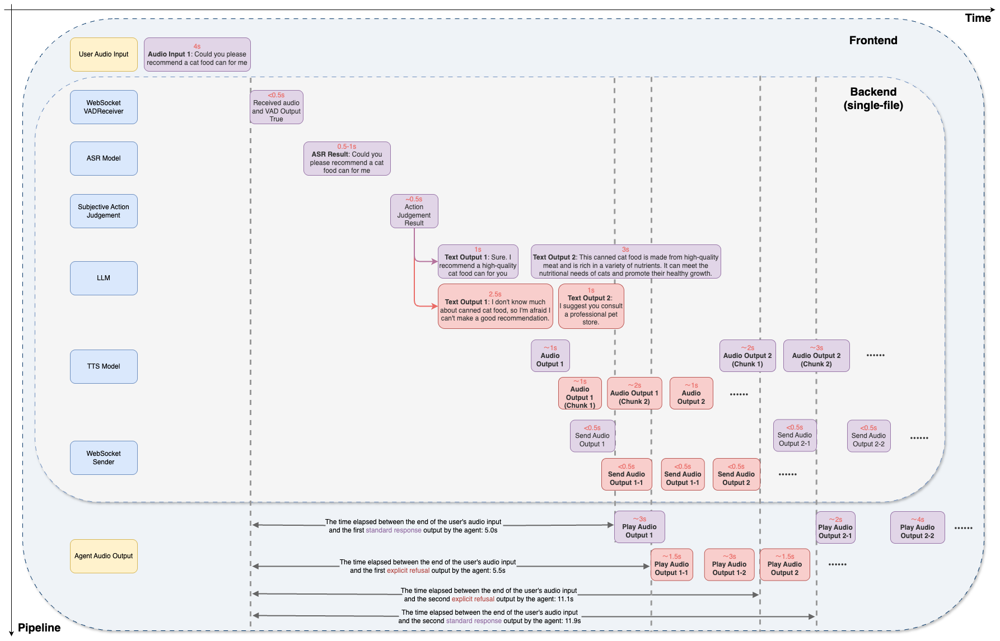

# CleanS2S

English | [简体中文(Simplified Chinese)](https://github.com/opendilab/CleanS2S/blob/main/README.zh.md) 

**CleanS2S** is a Speech-to-Speech (**S2S**) prototype agent that provides high-quality and streaming interactions in the single-file implementation. This design is simple and clean, aiming to provide a 
Chinese interactive prototype agent like the GPT-4o style. This project wants to let users directly experience the power of Linguistic User Interface (**LUI**) and quickly explore/vailidate the potential of the S2S pipeline for researchers.

Here are some live conversation demos of CleanS2S:

> Note: please unmute the video first.


<table>
<tr>
<td align="center">

**投资话题1**

</td>
<td align="center">

**投资话题2**

</td>
<td align="center">

**心情话题**

</td>
<td align="center">

**高考志愿话题**

</td>
</tr>
<tr>
<td align="center">

[投资话题1](https://github.com/user-attachments/assets/65333528-b07c-42ab-9cb5-660b68b404c4)

</td>
<td align="center">

[投资话题2](https://github.com/user-attachments/assets/f6ee3bad-ddd0-404f-9995-088ac1902b11)

</td>
<td align="center">

[心情话题](https://github.com/user-attachments/assets/40d20126-9c6b-45db-8ee9-ce768fee5b3f)

</td>
<td align="center">

[高考志愿话题](https://github.com/user-attachments/assets/e86c1cad-ca49-4145-8c22-8d9de59f44b4)

</td>
</tr>
</table>


<br>
<details>
<summary><strong style="font-size: 1.5em;">More Conversation Demos</strong></summary>
<br>

<table>
<tr>
<td align="center">

**胃病话题**

</td>
</tr>
<tr>
<td align="center">

[胃药话题](https://github.com/user-attachments/assets/84d27040-52b5-478e-8796-48ea7f468dc9)

</td>
</tr>
</table>

</details>


## Outline

- [Outline](#outline)
- [Features](#features)
- [Get Started](#get-started)
  - [Backend (Server)](#backend-server)
  - [Frontend (Client)](#frontend-client)
- [Roadmap](#roadmap)
- [Support and Get Involved](#support-and-get-involved)
- [Acknowledgements](#acknowledgements)
- [Citing CleanS2S](#citing-cleans2s)
- [License](#license)


## Features

### 📜 Single-file implementation

Every detail about a kind of agent pipeline is put into a single standalone file. There is no extra burden to configure the dependencies and understand the project file structure.
So it is a great reference implementation to read for folks who want to quickly have a glance at the S2S pipeline and directly vailidate novel ideas on top of it.
All the pipeline implementations are easy to modify and extend, and the user can quickly change the model (e.g. LLM) they like, add new components, or customize the pipeline.

### 🎮 Real-time streaming interface



The whole S2S pipeline is mainly composed of `ASR` (Automatic Speech Recognition, or named Speech to Text), `LLM` (Large Language Model), and `TTS` (Text to Speech), together with two `WebSockets` components Receiver (contains VAD) and Sender.
The pipeline is designed to be real-time streaming, which means the user can interact with the agent in real-time like a human-to-human conversation. All the audio and text information is streamed sent and received through the WebSocket.
To achieve this, we utilize multi-threading and queueing mechanisms to ensure the streaming process and avoid the blocking issue. All the components are designed to be asynchronous and non-blocking, processing the data from input queue and output result into another queue.

### 🧫 Full-duplex interaction with interruptions

Based on the powerful mechanisms provided by [WebSockets](https://websockets.readthedocs.io/en/stable/), the pipeline supports full-duplex interaction, which means the user can speak and listen to the agent at the same time.
Furthermore, the pipeline supports interruptions, which means the user can interrupt the agent at any time during the conversation with a new sppech input. The agent will stop current processing and start to process the new input with the context of the previous conversations and interruptions.
Besides, we find the "assistant-style" and "turned-based" response usually used in chatbot is one of the most important drawbacks for human-like conversation. We add more interesting strategies for the agent to make the conversation more interactive and engaging. 

### 🌍 Complemented with Web Search and RAG

The pipeline is further enhanced by the integration of web search capabilities and the Retrieval-Augmented Generation (RAG) model. 
These features provide the agent with the ability to not only process and respond to user inputs in real-time but also to access and incorporate external information from the web into its responses. 
This provides room for expansion and agility in answering various practical questions raised by users.
  - The WebSearchHelper class is responsible for conducting online searches based on user queries or to gather additional information relevant to the conversation. This allows the agent to reference up-to-date or external data, enhancing the richness and accuracy of its responses.
  - The RAG class implements a retrieval-augmented generation approach, which first retrieves relevant information from a database and then uses that information to generate responses. This two-step process ensures that the agent's replies are grounded in relevant, factual data, leading to more informed and contextually appropriate interactions.

#### output examples
> Note: Due to our computing resource limitations, the maximum token output is limited to a small size.
<table>
  <tr>
    <th>Case</th>
    <td>
      <strong>LanguageModelHandler</strong><br>
      <span style="color: grey; font-size: smaller;"></span>
    </td>
    <td>
      <strong>RAGLanguageModelHelper</strong><br>
      <span style="color: grey; font-size: smaller;"></span>
    </td>
  </tr>
  <tr>
    <td>1</td>
    <td>芭比波朗虫草粉底液产品口播文案\n\n大家好，我是你们的美妆达人小美，今天我要向大家介绍一款我最近发现的宝藏产品——芭比波朗虫草粉底液。首先，让我们来看看这款粉底液的
产品特性。它采用三重持色科技，能够均匀分散，贴肤不结块，让你的妆容持久不暗沉。同时，它还拥有面霜级的质地，特别适合干性肌肤使用，能够提供长时间的滋润和保湿效果，使肌肤在上妆的同时得到滋养。其次，>让我们来看看这款粉底液是如何满足用户需求的。它含有37种护肤精粹，包括冬虫夏草与人参提取物，这些成分能够激发肌肤能量，提供抗老效果，同时积雪草与圣保罗草有助于紧致肌肤。此外，它还含有透明质酸与稻米>提取物，确保了粉底液的高保湿效果，使用后肌肤不会感到干燥紧绷。
    <td>天啊，我太恨芭比布朗了，为什么这么晚才让我知道还有这么好用的产品！芭比布朗，你不营销你的虫草粉底液你糊涂啊！\n\n你知道吗。我之前用的那些粉底液，不是卡粉就>是脱妆，冬天用还特别干，简直让人抓狂。直到我遇到了芭比波朗的虫草粉底液，我的天，简直是干皮救星！它的质地就像面霜一样，滋润得不得了，上妆后皮肤感觉水润润的，完全没有紧绷感。而且，它的粉质超级细腻>，用三重持色科技，上妆后均匀分散，贴肤不结块，简直就是自然无瑕的代名词。更别提</td>
  </tr>
  <tr>
    <td>2</td>
    <td>MAC无暇粉底液二代\n\n## 产品特性\n\nMAC无暇粉底液二代是一款专为油皮星姐妹打造的粉底液。它具有以下特点：\n\n- 持久控油：能够24小时持妆，即使到了晚上也能保持妆容>不花。- 全新科技：采用PRO流体黑科技，使得粉底液能够均匀覆盖肤色，同时保持轻薄服帖。- 不脱妆：妆效持久，不卡粉、不斑驳，不拔干，适合长时间保持完美妆容。- 控油成分：含有糖海带精粹，有助于控油，使油
性皮肤能够全天保持雾面效果。- 高遮瑕力：能够有效遮盖痘痘、痘坑和毛孔，提供高遮瑕效果，即使近距离观察也不怕。- 养肤成分：含有80%的养肤精粹，成分温和，有助于抵抗外界刺激，同时长效平衡水油。- 专为亚洲肌肤定制：提供三大明星色号，适合亚洲人的肤色，更容易找到匹配自己肤色的粉底液。## 用户需求对接\n\n油皮星姐妹常常苦恼于粉底液经常脱妆，容易氧化，假白等问题。而MAC无暇粉底液二代正是为了解决这些问>题而生。它能够持久控油，不脱妆，不卡粉，不斑驳，不拔干，适合爱夜生活的晚8人们。同时，它还能够遮盖痘痘、痘坑和毛孔，提供高遮瑕效果，让油皮姐妹们在任何场合都能保持完美妆容。
    <td>嘿，油皮姐妹们，是不是常常为脱妆、氧化、假白这些问题烦恼。别担心，MAC无暇粉底液二代来拯救你们啦！这款粉底液简直就是油皮的救星，24小时持妆，晚8点出门也不怕>花妆，整夜都能保持无暇状态。全新PRO流体黑科技，让你的肤色匀净，轻薄服帖，妆效持久不卡粉、不斑驳，不拔干。更厉害的是，它含有糖海带精粹，一抹就能控油，大油皮全天都能保持雾面效果。痘痘、痘坑、毛孔统
统不在话下，高遮瑕力让你不怕怼脸看。而且，80%的养肤精粹</td>
  </tr>

</table>


## Get started

### Backend (Server)

#### Installation
```bash
## clone the repository
git clone https://github.com/opendilab/CleanS2S.git
cd CleanS2S/backend
pip install -r requirements.txt
```

- Install `funasr (1.1.6 recommended)` for paraformer-zh according to the instructions [here](https://github.com/modelscope/FunASR?tab=readme-ov-file#installation)
- Install `cosyvoice` for CosyVoice-300M according to the instructions [here](https://github.com/FunAudioLLM/CosyVoice?tab=readme-ov-file#install)

#### Downloading models
Here are 4 necessary models you need to download (3 ASR + 1 TTS), you can download them from the following links and put them in your own proper directory.
- ASR: [paraformer-zh](https://huggingface.co/funasr/paraformer-zh), [ct-punc](https://huggingface.co/funasr/ct-punc), [fsmn-vad](https://huggingface.co/funasr/fsmn-vad)
- TTS: [CosyVoice-300M](https://github.com/FunAudioLLM/CosyVoice?tab=readme-ov-file#install)

For LLM, we use LLM API by default, you can also follow the instructions below to customize your own local LLM (such as DeepSeek-V2.5, Qwen2.5, etc.).

> delete the `--enable_llm_api` and `--lm_model_url` parameters, and modify the `--lm_model_name` parameter to your local LLM model path (e.g., `--lm_model_name /home/users/deepseek-v2.5`).

You also need to prepare a reference audio directory, which contains the reference audios for the prosody and timbre transfer. Here we prepare a [sample reference audio directory](https://github.com/opendilab/CleanS2S/tree/main/backend/ref_audio) in this repository.
If you want to use your own reference audio, you need to keep it in the same format as the sample reference audio directory. And the audio should be 10~20 seconds long with clear pronunciation.


#### Running the server

Here is an example of running the server with the default settings:
```bash
export LLM_API_KEY=<your-deepseek-api-key>
python3 -u s2s_server_pipeline.py \
        --recv_host 0.0.0.0 \
        --send_host 0.0.0.0 \
        --stt_model_name <your-asr-path> \
        --enable_llm_api \
        --lm_model_name "deepseek-chat" \
        --lm_model_url "https://api.deepseek.com" \
        --tts_model_name <your-tts-path> \
        --ref_dir <ref-audio-path> \
        --enable_interruption
```
> ℹ️ **Support for customized LLM**: Here we use deepseek-chat as the default LLM API, you can also change to other LLM API follow the OpenAI interface. (modify the `--lm_model_name` and `--lm_model_url`, set your own API key)

> ℹ️ **Support for other customizations**: You can refer to the parameters list implemented by the `argparse` library in the backend pipeline file (e.g. `s2s_server_pipeline.py`) to customize it according to your own needs.
All the parameters are well-documented in their help attributes and easy to understand.

<br>
<details>
<summary><strong style="font-size: 1.5em;">Running the server w/ Websearch+RAG</strong></summary>
<br>
  
You should install the dependencies which Websearch and RAG needed first.
  
```bash
pip install -r backend/requirements-rag.txt
```

Second, choose an embedding model for embedding websearch result in RAG.
like the followinging embedding model:

```bash
git lfs install
git clone https://huggingface.co/sentence-transformers/all-MiniLM-L6-v2
```

Then, provide tokens for Websearch and RAG module, in `s2s_server_pipeline_rag.py` we use [Serper](https://serper.dev) as Websearch tool and [Deepseek](https://deepseek.com) for RAG.

```bash
export LLM_API_KEY=''
export SERPER_API_KEY=''
```

Finally, replace `s2s_server_pipeline.py` with `s2s_server_pipeline_rag.py` in the example code given in running the server. and add an arguments `--embedding_model_name`.

Here is an example of running the server with the default settings with Webseach+RAG:

```bash
python3 -u s2s_server_pipeline_rag.py \
        --recv_host 0.0.0.0 \
        --send_host 0.0.0.0 \
        --stt_model_name <your-asr-path> \
        --enable_llm_api \
        --lm_model_name "deepseek-chat" \
        --lm_model_url "https://api.deepseek.com" \
        --tts_model_name <your-tts-path> \
        --embedding_model_name <embedding-model-path> \
        --ref_dir <ref-audio-path> \
        --enable_interruption
```
</details>


### Frontend (Client)

We recommend using the `Docker image` for install and run the client. Here is the specific steps:

```bash
## run the basic docker image
docker run -it -p 3001:3001 amazonlinux:2023.2.20231011.0 sh
```

```bash
## install the necessary packages
dnf install vim git nodejs -y
npm install -g pnpm
git clone https://github.com/opendilab/CleanS2S.git
cd CleanS2S/frontend_nextjs
pnpm install
```

Prepare the proper `.env.local` file in the `frontend_nextjs` directory, you can refer to the `.env.example` file for the necessary environment variables.

```bash
## run the client
pnpm dev --port 3001
```

Then you can visit the client at `http://localhost:3001` in your browser (Chrome is recommended).

P.S.: If you want to run the client locally, you should install node.js and pnpm first, then use pnmp to install the necessary packages and run the client.

## Roadmap
- [x] Voice Conversion Pipeline (ASR + TTS) (i.e., backend/vc_server_pipeline.py)
- [x] WebUI optimization (support more diverse interactions and functions)
- [ ] Inference speed optimization
- [x] Multi-user support for backend
- [x] Long-term memory and proactive intent mechanism in dialogue
- [x] Non-textual interaction mechanisms such as emoji packs
- [x] More prompts and RAG strategies (serper + jina + LightRAG)
- [ ] Practical voiceprint detection mechanism in real scenes
- [ ] More examples and evaluation utilities
- [ ] Customized example characters
- [ ] More interesting interraction and challenging mechanism
- [ ] e2e s2s model training and deployment

## Support and get involved

We appreciate all the feedbacks and contributions. Feel free to ask questions. Posting in Github Issues and PRs are also welcome.

- [File an issue](https://github.com/opendilab/CleanS2S/issues/new/choose) on Github
- Discuss on CleanS2S [discord channel](https://discord.gg/dkZS2JF56X)
- Discuss on OpenDILab's WeChat group (i.e. add us on WeChat: ding314assist)


## Acknowledgements
- We thank [speech-to-speech](https://github.com/huggingface/speech-to-speech) for first open-sourcing the English speech-to-speech pipeline.
- We thank [funasr](https://github.com/modelscope/FunASR) and [CosyVoice](https://github.com/FunAudioLLM/CosyVoice) for open-sourcing high-quality Chinese ASR/TTS models.
- We thank [HumeAI](https://github.com/HumeAI) for open-sourcing a series of frontend components.

## Citing CleanS2S
```latex
@misc{lu2025cleans2s
      title={CleanS2S: Single-file Framework for Proactive Speech-to-Speech Interaction}, 
      author={Yudong Lu and Yazhe Niu and Shuai Hu and Haolin Wang},
      year={2025},
      eprint={2506.01268},
      archivePrefix={arXiv},
      primaryClass={cs.AI},
      url={https://arxiv.org/abs/2506.01268}, 
}
```

## License

CleanS2S released under the Apache 2.0 license.
