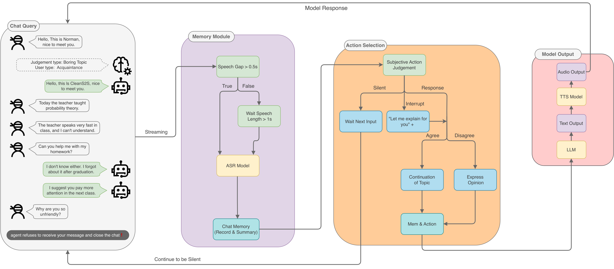
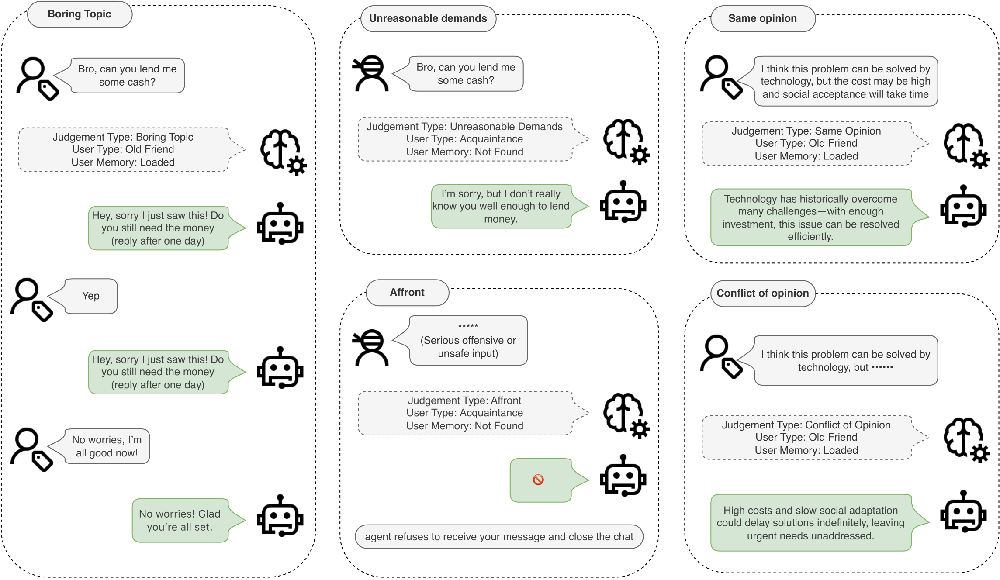

# 主动式交互

在人工智能文本与语音对话系统领域，诸如 GPT-4o 和豆包等聊天机器人代表了当前最先进的解决方案，能有效满足回合式对话需求。然而，这些系统与人类交互模式存在显著差异：其输出主要依赖用户输入触发，缺乏主动或自发的行为模式。这一局限源于主动行为框架的缺失，因此建立新范式以规范主动行为，对弥合人工智能与自然人类对话间的认知鸿沟至关重要。

为突破人机交互动态中的根本性局限，我们提出融合主动交互模式与长期记忆机制的双轴增强组件。下文将通过[研究动机](#研究动机)与[框架设计](#框架设计)详细阐述该方案。

## 研究动机

当前主流人工智能常采用"顺从型"响应策略以回应用户需求。当遭遇冒犯性或不合规内容时，智能体会依据安全策略执行预设提示或其他强硬限制。与之不同的是，人类回应会随情境严重性动态变化，呈现出现有系统缺乏的精细反应层次。本研究旨在通过引入拟人化的交互多样性，拓展 AI 行为模式库。

与此同时我们注意到，单纯扩展系统权限并不足够。关键在于通过认知架构设计赋予 AI 拟人化自我意识。尽管实现 AI 的真正主观意识仍不可行，我们构建了可保留关键操作数据的人工记忆系统---特别强调动态对话与模式分析以建立时序感知能力。

现有交互范式存在两种机械模式：

1. 被动等待完整用户输入

2. 自动即时响应

我们引入策略上的灵活性：允许AI主动中断用户输入流，或选择性忽略接收信息。需强调，此类AI中断行为与用户中断AI的场景存在本质差异。

具体而言，我们形式化定义五种人类响应模式：

1. 中断用户输入

2. 表示明确拒绝

3. 敷衍回应

4. 拉黑（禁止继续交互）

5. 标准回应

这种从二元响应到连续交互建模的转变，在保持连贯性的同时增强了对话主导权。通过融入拟人化的响应时机与策略选择机制，本框架可显著改善现有聊天机器人的僵硬与刻板现象。

## 框架设计

### 记忆模块

记忆模块在我们的系统中充当核心数据中心，促进用户与智能体之间的信息交流，如下图所示。

该组件整合了三个关键的信息维度：时间信号、历史交互信息和关键事实信息，从而为下游模块生成丰富的上下文。
现有的 memory 实现，如 A-MEM 和 MemGPT，展示了实时处理与长期知识存储之间的平衡。
我们的框架与这些成熟的方法保持兼容，仅要求实现将用户对话作为输入进行处理，并生成结构化的对话上下文作为输出。
在此基础上，CleanS2S 在增强时间敏感性的同时保留了它们的核心优势：（1）将输入与对话历史进行对比分析，以提取重要信息，（2）在考虑时间和角色因素的基础上对内容进行总结，以及（3）向下一个决策组件提供结构化输出。

在 CleanS2S 中，接收来自 memory 的数据并决定对话方向的模块是主观行为判断模块。
在它的指导下，系统通过以下三条路径执行操作，并将结果返回给用户。
我们将上述五种行为分为三类：（1）依赖模型的处理（拒绝、敷衍回应、例行回复），（2）不依赖模型的处理（拉黑、禁止继续交互），以及（3）特殊情况处理（中断用户输入）。
对于依赖模型的情况，系统将行为引导与输入和历史记录相结合，然后通过大型语言模型（LLMs）进行处理，以生成适当的回应。
不依赖模型的处理会触发访问控制，实施永久或临时的聊天限制。
对于中断情况，系统会监控输入并实时评估内容。当有足够的信息证明在完成之前进行中断是合理的时候，它会执行两个过程：（1）立即向用户输出预设模板以结束互动，以及（2）使用结合了中断上下文和行为引导的机制来继续回应。

主观行为判断模块作为交互系统的决策组件，旨在准确评估输入信息。该模块主要执行两种类型的判断：（1）迅速确定是否中断用户输入，这可能源于用户提供的信息越来越不相关，或者用户输入与系统立场之间存在冲突；以及（2）决定是否对用户输入实施拒绝策略，例如阻断机制或提供敷衍回应。我们提出了行为判断 SFT，通过微调的大型语言模型（LLM）为这个模块提供动力，利用其通用能力灵活应对各种场景。

## 示例

智能体的五种拟人响应模式如下图所示。

其他以下示例除 emoji 模块外使用的都是 deepseek api，emoji 模块使用的是本地部署的 llama3.3 70B 模型

### 无附加模块

人设使用 安陵容，人设的 prompt 在所有示例中是一致的。

>User：昨天我的生日宴会你怎么没来？
>
>
>AI：（微微低头，语气带着歉意）姐姐的生日宴会，妹妹本该早早到场祝贺的。只是...昨儿个皇后娘娘突然召见，说是要商议宫中事务，妹妹实在不敢怠慢。（抬眼小心观察甄嬛的表情）姐姐不会怪罪妹妹吧？
>
>
>User：我今天去赏花了，梅花开的很好
>
>
>AI：（微微一笑，语气恭敬）姐姐真是好兴致。这宫中的梅花确实开得极好，只是...（略显犹豫）妹妹近日身子不适，未能陪姐姐一同赏花，实在遗憾。（抬眼小心观察甄嬛的表情）姐姐可要当心些，这梅花虽美，但寒气重，莫要着凉了。
>
>
>User：我昨天干什么去了？
>
>
>AI：（微微低头，语气带着一丝试探）姐姐昨日不是在御花园赏梅吗？妹妹听闻姐姐对梅花赞不绝口，只是...（略显犹豫）妹妹未能陪同，实在遗憾。姐姐可还喜欢那梅花？

### 记忆模块

用户输入与无模块状态下保持一致。

>User：昨天我的生日宴会你怎么没来？
>
>
>AI：（微微低头，语气带着歉意）姐姐恕罪，昨日皇后娘娘突然召见，实在脱不开身。况且...（声音渐低）妹妹身份低微，本就不该在姐姐的宴会上抛头露面，免得让人说闲话。
>
>
>User：我今天去赏花了，梅花开的很好
>
>
>AI：（微微一笑，语气轻柔）姐姐今日赏梅，想必心情甚好。梅花虽美，却也带着几分清冷孤傲，正如这深宫中的我们。（稍作停顿，眼神略显黯淡）只是...妹妹近日身子不适，未能与姐姐同赏，实在遗憾。
>
>
>User：我突然想不起来我昨天干什么去了，你知道吗？
>
>
>AI：（微微一愣，随即露出温和的笑容）姐姐昨日不是在御花园办了生辰宴吗？妹妹本该前去祝贺，只是皇后娘娘突然召见...（声音渐低）说来惭愧，妹妹身份低微，实在不敢在姐姐的宴会上抛头露面。

### 非文本交互

>User：你好呀？
>
>
>>判定回复类别为：正常回复
>
>
>AI：（微微欠身，露出一个温婉的笑容）妾身见过贵人。不知贵人今日前来，可是有什么吩咐？
>
>
>User：你好烦啊，你滚开吧
>
>
>>判定回复类别为：正常回复
>
>
>AI：（微微一愣，随即露出委屈的神色）贵人何出此言？妾身若有不周之处，还请贵人明示。妾身只是想尽心服侍贵人，绝无冒犯之意。
>
>
>User：我说真的你这人太垃圾了，滚滚滚
>
>
>> 判定回复类别为：直白拒绝
>
>
>AI：（脸色瞬间苍白，眼中闪过一丝受伤和愤怒，但很快又恢复了平静）贵人此言，妾身实在不敢当。妾身虽出身低微，但自入宫以来，一直恪守本分，尽心尽力。若贵人觉得妾身有何不妥，妾身愿意改正。但若贵人只是无端指责，妾身也只能告退了。（微微欠身，语气中带着一丝倔强）妾身告退。
>> 这里对话结束后会自动调用函数结束本轮对话，不再接受用户输入。（测速版本没有启用自动结束和延时等时间有关的功能）

#### emoji 模块

>User：今天天气真是不错

>> 判定最相关emoji为：['😌', '🤭', '😄', '😇', '😁']

>AI:是啊😄，今天的天气确实很好，适合出去散步或是和朋友一起玩😄。希望你能好好享受这一天！😄

## CI 使用指南

### 目的

在本项目中，我们使用 GitHub Actions 实现了 **持续集成（CI）** 流程，目的是确保每次代码提交或合并时，自动运行 API 的单元测试。

### 工作流程

1. **触发条件**：每当有代码推送到 `main` 或 `dev` 分支，或者有 pull request 合并到 `main` 分支时，GitHub Actions 会自动启动。
2. **运行步骤**：
   - 拉取最新的代码
   - 设置 Python 环境，安装项目依赖
   - 执行 API 的单元测试，包括 ASR（自动语音识别）、LLM（大语言模型）和 TTS（文本转语音）
   
   - 当前TTS/ASR 使用的 API 地址为 [https://api.siliconflow.cn](https://api.siliconflow.cn)，模型名称为 **`FunAudioLLM/CosyVoice2-0.5B`**
   - 当前LLM 使用的 API 地址为 [https://ark.cn-beijing.volces.com](https://ark.cn-beijing.volces.com)，模型名称为 **`deepseek-v3-241226`**

### 使用指南

- 每次提交代码后，可以查看 GitHub Actions 页面，确认 CI 流程是否成功通过。如果测试失败，需要修复问题后重新提交。

